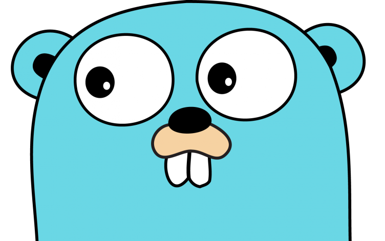
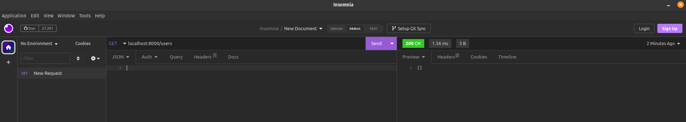
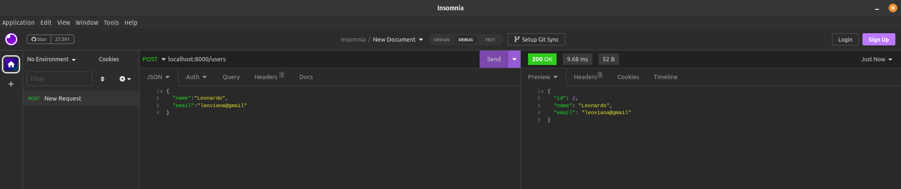
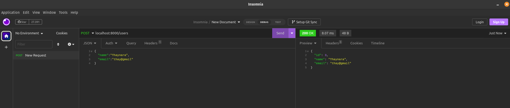
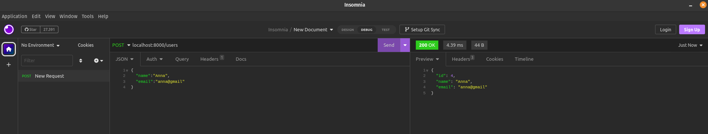
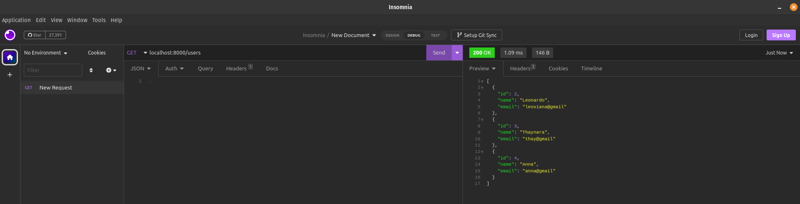
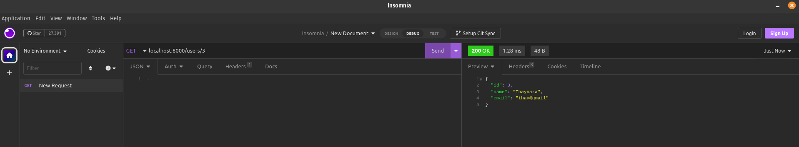
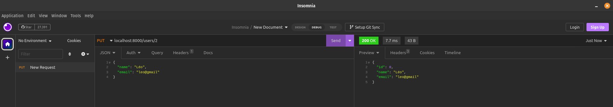
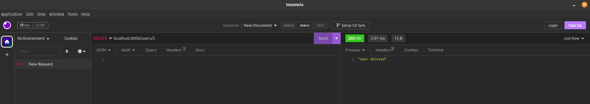

<h1 align="center">CRUD com Go e Postgresql </h1>

<p align="center">
  
  
</p>

<p align="center">
  <a href="#-projeto">Projeto</a>&nbsp;&nbsp;&nbsp;|&nbsp;&nbsp;&nbsp;
  <a href="#-tecnologias">Tecnologias</a>&nbsp;&nbsp;&nbsp;|&nbsp;&nbsp;&nbsp;
  <a href="#-etapas">Etapas</a>&nbsp;&nbsp;&nbsp;|&nbsp;&nbsp;&nbsp;
  <a href="#-requisitos">Requisitos</a>&nbsp;&nbsp;&nbsp;|&nbsp;&nbsp;&nbsp;
  <a href="#-licença">Licença</a>&nbsp;&nbsp;&nbsp;|&nbsp;&nbsp;&nbsp;
  <a href="#-referências">Referências</a>
</p>

<p align="center">
  
</p>

## 🌱 Projeto

- Criar uma API CRUD Rest em GO
- Criar 5 endpoints para operações CRUD básicas:
    - Create
    - Read all
    - Read one
    - Update
    - Delete

## ✨ Tecnologias

- Mux (Framework para construir servidores web em Go)
- Postgres (banco de dados relacional)
- Docker (para conteinerização)
- Docker Compose

## 🚀 Etapas

- [x] Criar um aplicativo Go usando Mux como uma estrutura
- [x] Dockerizar o aplicativo Go escrevendo um Dockerfile e um arquivo docker-compose.yml para executar o aplicativo e o banco de dados.
- [x] Execute o banco de dados Postgres em um contêiner usando o Docker Compose e teste-o com o TablePlus.
- [x] Crie a imagem do Go App e execute-a em um contêiner usando o Docker Compose e, em seguida, teste-a com o Insomnia.

## 🗒 Requisitos

## Criando o Projeto

- Inicializando um novo módulo Go usando este comando

```bash
go mod init api
```

- Instalando dependências

```bash
go get github.com/gorilla/mux github.com/lib/pq
```

- Criando `Dockerfile`, `docker-compose.yml` e `main.go`

```bash
touch main.go Dockerfile docker-compose.yml
```


## 🚀 Execução

```bash
docker compose up --build
```

## 🔍 Teste o aplicativo

- Requisição `GET` para localhost:8000/users
- Deve retornar um array vazio

<p align="center">
  
</p>

## 📝 Crie um usuário

- Fazer uma requisição `POST` para localhost:8000/users

- Criar usuário 1.

<p align="center">
  
</p>

- Criar usuário 2.

<p align="center">
  
</p>

- Criar usuário 3.

<p align="center">
  
</p>

## 📝 Obtenha todos os usuários

- Pegar todos os usuários fazendo uma requisição `GET` para localhost:8000/users

<p align="center">
  
</p>

## 📝 Obtenha um usuário

- Obtendo um usuário específico, solicitação `GET` para localhost:8000/user/3

<p align="center">
  
</p>

## 📝 Atualize um usuário

- Atualizando um item em específico, solicitação `PUT` localhost:8000/users/2 fornecendo um novo corpo

<p align="center">
  
</p>

## 📝 Excluir um usuário

- Excluindo o usuário 2, solicitação `DELETE` para localhost:8000/users/2

<p align="center">
  
</p>


## 📄 Licença

## 🙇 Referências

- [TABLEPLUS](https://tableplus.com/blog/2019/10/tableplus-linux-installation.html)
- [INSOMNIA](https://insomnia.rest/download)